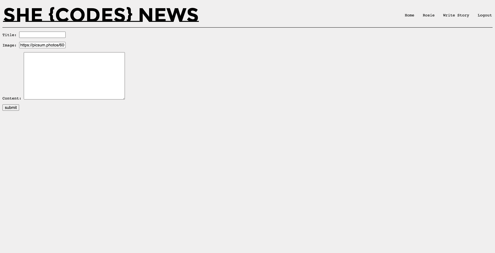
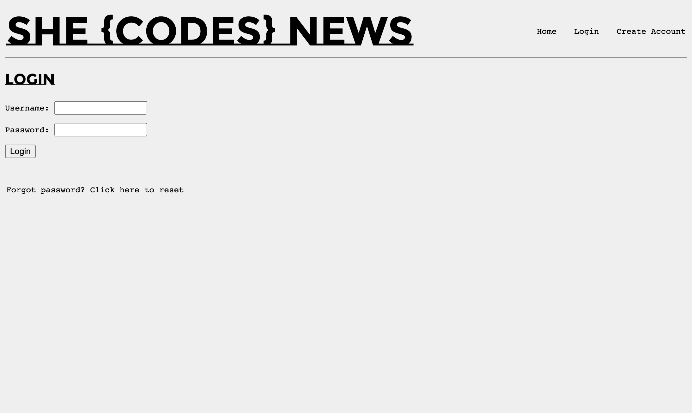
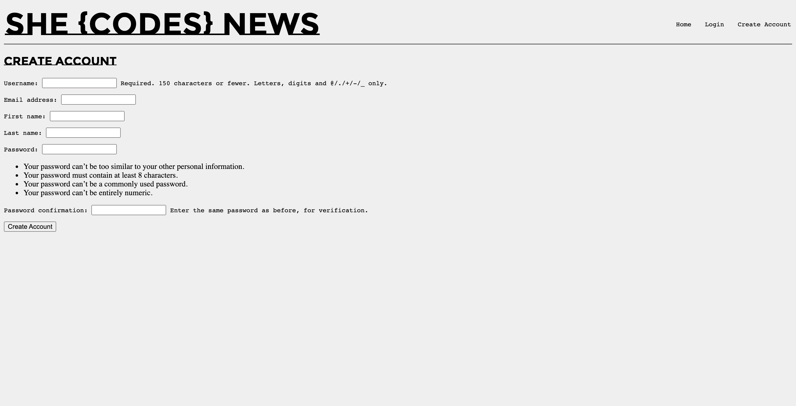
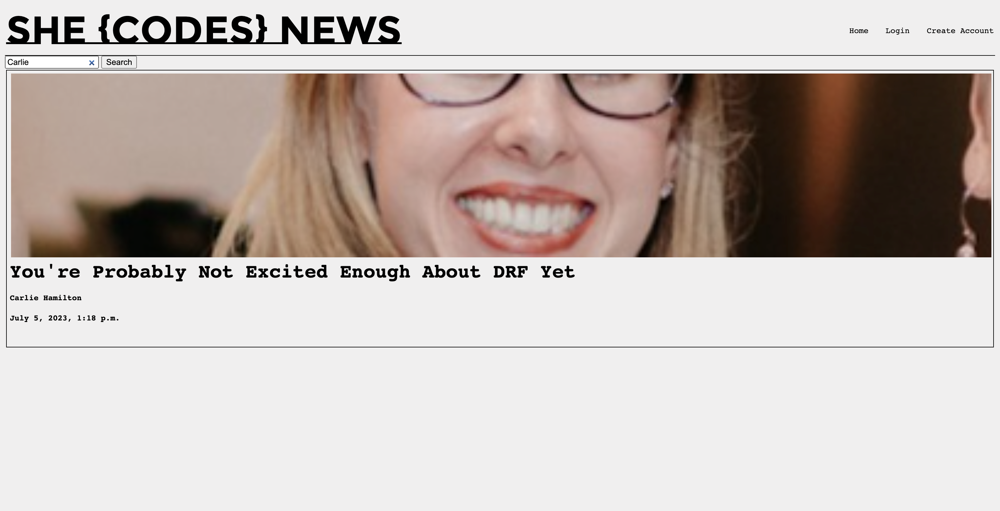
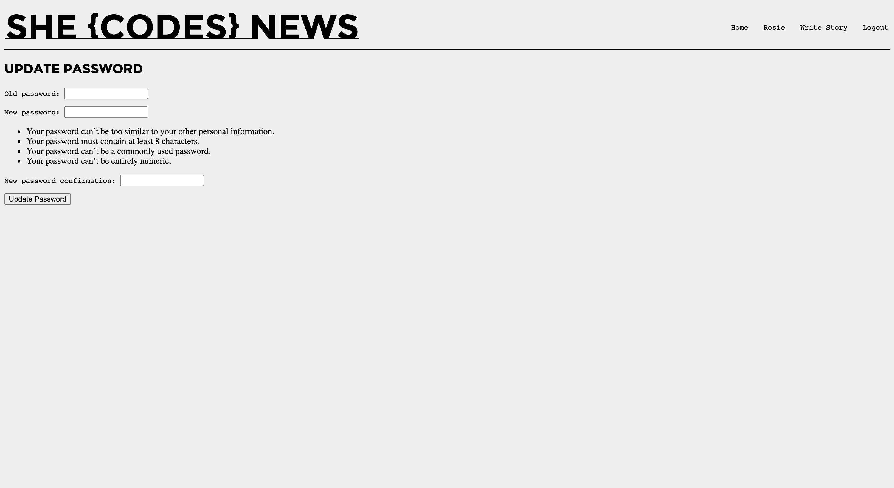

# Rosie Maguire - She Codes News Project
## About This Project
This project uses HTML, CSS and the Django framework. It is a news website that allows users to read news stories, and authors to create them.

## Prerequisites
- `python`
- `pip`
- unrestricted execution policy (Windows requirement)
## How To Run This Code
- Clone a copy of this repo to your local machine. This can be done in the command line by navigating to the desired directory, then running:

        git clone https://github.com/rosiemaguire/django-project-she-codes-news.git
- Once you have a local version of this repository, you'll need to set up your virtual environment:
    -  navigate to the folder that contains the `requirements.txt` file
    - If you're on a windows machine, run the command 
            
            . venv/Scripts/activate
    - If you're on a mac, run the command 
            
            source venv/bin/activate
    - Install the Django library: 
            
            python -m pip install -r requirements.txt
    - Check installation was successful: 
    
            python -m pip freeze
    - Change directory to where manage.py is located:
            
            cd she_codes_news
    - Make the inital migrations:
        
            python manage.py migrate
    - Load the template data for the news articles by running these two commands:
            
            python manage.py loaddata users
            python manage.py loaddata news
    - Now with everything set up, you'll just need to run the server!

            python manage.py runserver
    - Open http://localhost:8000/news to view and interact with the website
    - When you're finished press CTRL+C to quit the server
    - Deactivate the virtual environment by either using the command `deactivate` or terminate your terminal session.

## Database Schema

## Project Features
- [X] Order stories by date
    
- [X] Styled "new story" form
    
- [X] Story images
    
- [X] Log-in/log-out
    
    
- [X] "Account view" page
    
- [X] "Create Account" page
    
- [X] View stories by author
    
- [X] "Log-in" button only visible when no user is logged in/"Log-out" button only visible when a user *is* logged in
    
- [X] "Create Story" functionality only available when user is logged in
    
## Additional Features:
- [ ] Add categories to the stories and allow the user to search for stories by category.

- [ ] Add the ability to update and delete stories (consider permissions - whoshould be allowed to update or and/or delete stories).

- [ ] Add the ability to “favourite” stories and see a page with your favourite stories.

- [X] Our form for creating stories requires you to add the publication date, update this to automatically save the publication date as the day the story was first published (maybe you could then add a field to showwhen the story was updated).
    
- [ ] Gracefully handle the error where someone tries to create a new story whenthey are not logged in.

